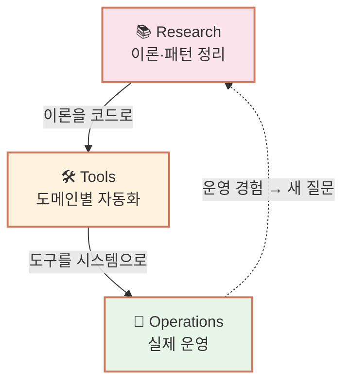
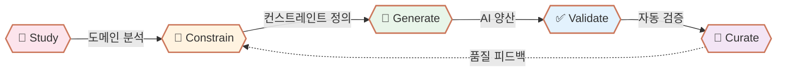

<h1 align="center">
  
  IQ Agent Lab
</h1>

**에이전트 시스템으로 창작 영역을 자동화하는 1인 연구소**

 

 

> *"한 사람이 한 도메인의 콘텐츠를 양산하는 시대는 끝났다. 이제는 시스템이 여러 도메인을 동시에 운영한다."*

표면적인 자동화가 아닌,
**검증 가능하고 큐레이션 가능한 운영 시스템** 을 만듭니다.

 

---

## 🛠️ Tools Showcase

이 연구소의 핵심 산출물은 **도메인별 자동화 도구**입니다. 각 도구는 독립적으로 작동하지만, 공통된 패턴(컨스트레인트 + 검증 + 큐레이션)을 공유합니다.

<table>
<tr>
<td width="50%" valign="top">

### 🤖 iq-blogger

**도메인** · 텍스트 (기술 블로그)

Deep-dive 문서를 블로그 포스트로 자동 변환하는 에이전트.

**Pipeline**
- Input: deep-dive 챕터
- Process: 11개 컨스트레인트 + Zod 검증 + 3회 재시도
- Output: 발행 가능한 MDX 포스트

**검증** · Zod schema, 링크 정합성, 코드 syntax
**현재** · 첫 검증 사례 [iq-blog](https://iq-universe.github.io/iq-blog/)에서 운영

</td>
<td width="50%" valign="top">

### 🪐 Solve Buddy

**도메인** · 학습 자동화 (LeetCode · 프로그래머스 · AtCoder · Codeforces)

4개 플랫폼 풀이를 한국어로 정리/번역하고, AI 회고를 붙여 GitHub에 자동 정리하는 **데스크톱 에이전트**. 한국어 원문(프로그래머스)은 cheerio 정리, 영어/일본어(LC/AC/CF)는 Claude streaming 번역.

**Pipeline**

- Input — 4개 플랫폼 URL · 임베드 chip · 최근 풀이 chip (플랫폼 badge 표시)
- Process — 정리/번역 (LC·AC·CF는 Claude streaming, PG는 cheerio + turndown 즉시 ~10ms) → 임베드 윈도우에서 직접 풀이 + submission 자동 가져오기 → streaming 회고 → atomic commit + 플랫폼별 폴더 + root README 인덱스 자동 갱신
- Output — 플랫폼별 학습 노트 레포 + 풀이 통계 dashboard (플랫폼 탭 분리)

**검증**

- Accepted 사전 확인 — LC / AC / CF (PG는 AC 개념 없어 미지원)
- 친절한 에러 + 자동 복구
- 회고 사후 편집 (`fix:` commit)
- draft 자동 저장 + 새 문제 fetch 시 editor 초기화
- 캐시 schema versioning — 추출 로직 변경 시 자동 refresh

**현재** · [v1.12.0 Releases](https://github.com/iq-agent-lab/iq-solvebuddy/releases/latest)

- 4개 플랫폼 풀 패리티 (임베드 + submission 자동 fetch)
- 임베드 윈도우 추상화 — `EmbedController` 1개 + 4개 config
- Gist 백업 디바이스 sync (private gist, newest savedAt wins)
- CodeMirror Cmd+F 검색 + 코드 fold + line wrap toggle
- KaTeX 수식 렌더링 (한국어 boundary 대응)
- AtCoder Problems 색깔 체계 (회색 → 갈색 → 녹색 → 청색 → 황색 → 주황 → 적색 → 레전드)
- Dark / Light / System 테마 · OS keychain · 자동 업데이트 polling
- macOS / Windows / Linux 자동 빌드

</td>
</tr>
<tr>
<td width="50%" valign="top">

### 📶 iq-wifi-snap

**도메인** · 일상 유틸리티 (와이파이 추출·공유·접속)

카페 와이파이 카드를 사진 한 장으로 찍으면 Claude Vision이 SSID/PW를 추출해 QR · OS 명령어 · 딥링크로 변환하는 **PWA 유틸리티 에이전트**. 백엔드 0, BYO API key.

**Pipeline**

- Input — 와이파이 카드 사진 / 영수증 / 메뉴판 / 스티커 / 손글씨
- Process — Claude Vision 추출 → 자동 폴백 (Tesseract.js 한/영 OCR + 로컬 라벨 파서) → QR 코드 + macOS/Win/Linux 명령어 + base64 딥링크 생성
- Output — 즉시 접속 QR · 데스크톱 CLI 호환 URL · 시스템/카톡 공유 카드 · `wifi-snap://` 딥링크

**검증**

- 추출 신뢰도 표시 (high / medium / low)
- 직접 편집 + QR 즉시 갱신
- 한국어/영문 카페 카드 회귀 테스트 (Modern · Handwritten · Minimal)
- 오프라인 OCR 폴백으로 인터넷 없을 때도 동작
- 추출당 비용 ~$0.001 (Haiku 4.5)

**현재** · [v0.12.0 Live Demo](https://iq-agent-lab.github.io/iq-wifi-snap/)

- 데스크톱 CLI (macOS/Linux/Windows) — `curl | bash` 한 줄 설치
- `wifi-snap://` 커스텀 URL 스킴 — 어디서든 클릭만으로 자동 연결
- 🔊 초음파/오디오 전송 (ggwave) — 인터넷·BT·페어링 0 폰→PC 전송
- 속도 측정 (Cloudflare) + 카페 지도 (Leaflet/OSM)
- 카카오톡 SDK 직접 공유 + PWA 오프라인 모드

</td>
<td width="50%" valign="top">

### 🎵 iq-label

**도메인** · 음악 (작곡·편곡)

음악 작품 자동 생산 + 큐레이션 레이블 시스템.

**Pipeline**
- Input: 장르·무드·구조 명세
- Process: 멀티 트랙 생성 + 화성 검증
- Output: 마스터링 가능한 음원 파일

**검증** · 화성 분석, 구조 일관성, 길이 제약
**계획** · 첫 운영: 인디 음악 레이블

</td>
</tr>
<tr>
<td width="50%" valign="top">

### ✍️ iq-writer

**도메인** · 장형 글쓰기 (소설·에세이)

소설·에세이 등 서사 콘텐츠 생성 + 일관성 관리.

**Pipeline**
- Input: 시놉시스, 캐릭터, 톤
- Process: 챕터별 생성 + 캐릭터 일관성 검증
- Output: 장편 서사 콘텐츠

**검증** · 캐릭터 일관성, 플롯 무결성, 톤 유지
**계획** · 단편소설 → 장편 → 시리즈

</td>
<td width="50%" valign="top">

### 🎨 iq-painter

**도메인** · 이미지·일러스트

스타일 일관된 비주얼 콘텐츠 생성 시스템.

**Pipeline**
- Input: 스타일 가이드, 컨셉
- Process: 다중 후보 생성 + 스타일 검증
- Output: 일관된 비주얼 셋

**검증** · 스타일 일관성, 색상 팔레트, 구도
**계획** · 블로그 일러스트 → 그림책 → 그래픽 노블

</td>
</tr>
<tr>
<td width="50%" valign="top">

### 🎬 iq-studio

**도메인** · 영상·미디어

짧은 영상 콘텐츠 (튜토리얼·해설) 자동 제작.

**Pipeline**
- Input: 스크립트, 비주얼 자료
- Process: 합성 + 자막 + 음성
- Output: 발행 가능한 영상

**검증** · 자막 동기화, 길이 제약, 음질
**계획** · 기술 해설 영상부터

</td>
<td width="50%" valign="top">

### 🌐 iq-curator

**도메인** · 통합 (메타 도구)

다도메인 콘텐츠 큐레이션 + 발행 오케스트레이션.

**Pipeline**
- Input: 모든 도구의 출력
- Process: 품질 평가 + 발행 결정 + 분배
- Output: 다중 채널 동시 발행

**검증** · 채널별 적합성, 시점, 우선순위
**계획** · 모든 도구 통합 후 마지막 단계

</td>
</tr>
<tr>
<td width="50%" valign="top">

### 🔬 next planet

**도메인** · 미정

iq-agent-lab은 1년에 도구 한두 개씩 자라는 살아있는 시스템입니다.

다음 행성은 운영 메트릭과 새로운 학습 영역에 따라 결정됩니다.

iq-blogger의 텍스트 양산이 안정되고, Solve Buddy의 학습 사이클이 4개 플랫폼에서 검증되고, iq-wifi-snap의 일상 유틸리티 패턴이 누적되면, 그 다음 도메인이 자연스럽게 떠오를 것입니다.

</td>
<td width="50%" valign="top">

&nbsp;

</td>
</tr>
</table>

---

## 🔄 The System

도구는 독립적이지만, 시스템으로서 순환합니다.

세 단계가 순환하는 구조입니다.

| Stage | 활동 | 산출물 |
|-------|------|--------|
| 📚 **Research** | 도메인별 deep-dive, 시스템 패턴 추출 | 연구 레포 |
| 🛠️ **Tools** | 이론을 동작하는 도구로 구현 | iq-blogger, Solve Buddy, iq-wifi-snap 등 |
| 🚀 **Operations** | 도구를 실제 운영 시스템으로 통합 | iq-blog, algorithm-solutions, iq-wifi-snap PWA 등 |

운영 경험은 다시 새로운 연구 질문이 됩니다. 글 1개를 만드는 것과 500개를 만드는 것은 본질적으로 다른 문제이고, 한 도메인을 자동화한 경험은 다른 도메인의 설계에 적용됩니다. iq-blogger에서 만든 *컨스트레인트 + 검증 + 재시도* 패턴이 Solve Buddy에서 *친절한 에러 + 자동 복구 + 멀티 플랫폼 추상화* 패턴으로, iq-wifi-snap에서 *Vision 추출 + 오프라인 OCR 폴백* 패턴으로 진화한 흐름이 좋은 예시입니다.

---

## 🚀 Live Operations

현재 운영 중이거나 가까운 미래에 시작될 시스템.

| 시스템 | 도구 | 상태 | 첫 메트릭 |
|--------|------|------|-----------|
| [iq-blog](https://iq-universe.github.io/iq-blog/) | iq-blogger | 🟢 Active | 500+ posts (target) |
| [algorithm-solutions](https://github.com/e9ua1/leetcode-solutions) | Solve Buddy | 🟢 Active | 4개 플랫폼 풀이 + 한국어 회고 누적 |
| [iq-wifi-snap](https://iq-agent-lab.github.io/iq-wifi-snap/) | iq-wifi-snap | 🟢 Active | v0.12.0 출하, 일상 유틸리티 자동화 사례 |
| iq-label sound | iq-label | ⚪ Planned | 인디 음악 레이블 |
| iq-narrative | iq-writer | ⚪ Planned | 단편 소설 시리즈 |
| iq-canvas | iq-painter | ⚪ Planned | 일러스트 시리즈 |
| iq-stream | iq-studio | ⚪ Planned | 기술 영상 채널 |

각 시스템은 도구의 **첫 번째 검증 사례**입니다. iq-blog가 iq-blogger의 검증이듯, algorithm-solutions가 Solve Buddy의 검증이며, iq-wifi-snap PWA가 자기 자신의 검증이기도 합니다. 각 운영 시스템은 그 도구가 실제로 작동한다는 증거가 됩니다.

---

## 🗺️ Roadmap

### Research Deep-dives — 계획

&nbsp;🤖 &nbsp;<b>Agent Foundations</b> &nbsp;&nbsp;

 

> 에이전트의 기본 구조와 설계 원칙

| &nbsp; | 📌 Title | 📝 Key Topics |
|:--:|:---------|:----------|
| 1 | **Agent Architectures Deep Dive** | ReAct, Reflexion, AutoGPT, BabyAGI 비교, 설계 패턴 |
| 2 | **Multi-Agent Systems Deep Dive** | 협업 패턴, 역할 분담, 통신 프로토콜, Orchestration |
| 3 | **Agent Tool Use Deep Dive** | Function Calling, MCP 프로토콜, Tool Selection, 안전성 |
| 4 | **Agent Memory Deep Dive** | Short/Long-term Memory, Episodic Memory, RAG 통합 |

 

&nbsp;🔬 &nbsp;<b>Agent Engineering</b> &nbsp;&nbsp;

 

> 에이전트를 실제로 만들고 평가하는 방법

| &nbsp; | 📌 Title | 📝 Key Topics |
|:--:|:---------|:----------|
| 1 | **Agent Eval Deep Dive** | Benchmark 설계, Trajectory 분석, Failure Mode, Cost-Performance |
| 2 | **Agent Deployment Deep Dive** | Production 운영, Observability, Sandboxing, Rate Limiting |
| 3 | **Prompt Engineering for Agents** | System Prompt 설계, Few-shot 패턴, Constraint 강제 |

 

&nbsp;🖥️ &nbsp;<b>Desktop Agents</b> &nbsp;&nbsp;

 

> 로컬에서 동작하는 에이전트의 설계와 배포 (Solve Buddy의 후속 연구)

| &nbsp; | 📌 Title | 📝 Key Topics |
|:--:|:---------|:----------|
| 1 | **Electron Agent Patterns Deep Dive** | Main/Renderer 분리, IPC progress streaming, secret-safe view, 영속 세션, 멀티 임베드 윈도우 추상화 |
| 2 | **Local-first Agent Deployment Deep Dive** | electron-builder, 코드 서명 우회, OS keychain, 자동 업데이트, GitHub Actions 매트릭스 빌드 |

 

### New Tools — 우선순위

도구 확장 순서:

1. ~~**iq-blogger 안정화**~~ ✓ 운영 중 (iq-blog로 검증)
2. ~~**Solve Buddy 출하**~~ ✓ 데스크톱 에이전트 첫 사례 (v1.12.0 발행, 4개 플랫폼 풀 패리티)
3. ~~**iq-wifi-snap 출하**~~ ✓ 일상 유틸리티 에이전트 첫 사례 (v0.12.0 발행)
4. **iq-writer / iq-painter** — 텍스트·이미지 도메인 확장
5. **iq-label / iq-studio** — 멀티미디어 도메인 진입
6. **iq-curator** — 모든 도구의 통합 오케스트레이터

각 단계는 이전 도구의 **운영 메트릭**으로 검증된 후에만 다음으로 진행합니다. iq-blogger의 텍스트 양산 패턴, Solve Buddy의 데스크톱 + 멀티 플랫폼 운영 패턴, iq-wifi-snap의 PWA·CLI 듀얼 폼팩터 패턴 — 세 갈래의 경험이 그다음 도구 선택에 반영됩니다.

---

## 🛠️ Build Method

각 도구는 동일한 사이클로 구축됩니다.

| Step | Description |
|------|-------------|
| 🔬 **Study** | 도메인 분석, 기존 도구 조사, 패턴 추출 |
| 🎯 **Constrain** | 출력 스키마, 형식, 품질 기준을 코드로 정의 |
| 🤖 **Generate** | 정의된 컨스트레인트 안에서 AI가 양산 |
| ✅ **Validate** | 스키마 + 도메인 특화 검증 + 자동 재시도 |
| 👤 **Curate** | 인간이 최종 품질 확인 + 발행 결정 |

이 다섯 단계는 도메인이 텍스트든 음악이든 이미지든 동일하게 적용됩니다. **검증·재시도·큐레이션의 추상화 패턴**이 도메인 간 전이의 핵심입니다.

Solve Buddy는 이 사이클이 *데스크톱 환경 + 멀티 플랫폼*에서도 동일하게 작동함을 보여준 사례입니다 — Study(4개 플랫폼 풀이 흐름 분석) → Constrain(플랫폼별 prompt + 정리 규칙 + 폴더 path) → Generate(Claude streaming + cheerio/turndown) → Validate(Accepted 사전 확인 + 친절 에러 + 캐시 schema versioning) → Curate(사용자가 통과 코드 확인 후 업로드 + 회고 사후 편집). 같은 사이클이 *한 플랫폼*에서 *4개 플랫폼*으로 확장되어도 핵심 추상화는 유지됩니다.

iq-wifi-snap은 이 패턴이 *일상 유틸리티 도메인*에도 적용됨을 확장한 사례입니다 — Study(카페 와이파이 카드 시각 패턴 분석) → Constrain(JSON 스키마 + 한국어/영문 라벨 파서) → Generate(Claude Vision API) → Validate(신뢰도 표시 + 회귀 테스트 + 오프라인 OCR 폴백) → Curate(사용자가 추출 결과 확인 + QR 직접 편집 + 즉시 갱신). 같은 사이클이 *서버 0, 백엔드 0, BYO API key*의 정적 PWA 형태로도 성립함을 증명합니다.

 

## 💡 Philosophy

> **"인간이 방향을 정하고, 에이전트가 양산하고, 큐레이션이 품질을 보증한다."**

### Why Agents First?

- 🎯 **검증 가능한 자동화** — 자유도가 높은 프롬프트가 아닌, 명시적 컨스트레인트로 일관성 보장
- 🔁 **자기 개선 루프** — 검증 실패 시 자동 재시도, 이전 오류를 학습 데이터로 활용
- 🌐 **도메인 전이** — 한 도메인에서 검증된 패턴을 다른 도메인으로 확장
- 📊 **운영 가능한 시스템** — 일회성 스크립트가 아닌, 지속적으로 콘텐츠를 생산하는 살아있는 인프라

### Three Principles

1. **Form follows constraint.** 명시적 스키마와 엄격한 검증이 느슨한 프롬프트와 사후 검토보다 더 신뢰할 수 있는 결과를 만든다.
2. **Curation is non-negotiable.** AI는 형식적 일관성을 보장하지만, 진짜 가치는 인간이 판단한다. 큐레이션 없는 자동화는 양산일 뿐이다.
3. **Infrastructure first.** 콘텐츠 1개를 만드는 것과 500개를 만드는 것은 본질적으로 다른 문제다. 처음부터 시스템으로 설계한다.

 

## 🔗 Connected Labs

| Lab | 역할 | 관계 |
|-----|------|------|
| [iq-dev-lab](https://iq-dev-lab.github.io) | 백엔드 시스템·인프라 deep-dive | 인프라 기반 제공 |
| [iq-ai-lab](https://iq-ai-lab.github.io) | AI 이론·수학적 기반 deep-dive | 이론 기반 제공 |
| **[iq-agent-lab](https://iq-agent-lab.github.io)** | 에이전트 시스템·자동화 인프라 | **이론과 시스템을 통합** |

세 연구소는 각자의 영역에서 독립적이지만 본질적으로 연결됩니다. AI 이론이 에이전트의 두뇌가 되고, 백엔드 시스템이 그 인프라가 되며, 에이전트가 다시 모든 연구소의 콘텐츠를 자동화합니다.

 

## 🔗 About

*에이전트 시스템으로 창작 영역을 자동화하는 1인 연구소*

 

검증된 결과물과 시스템 설계 회고는 [**IQ Blog**](https://iq-universe.github.io/iq-blog/)에 발행됩니다.

 

Operated by [@e9ua1](https://github.com/e9ua1) (아이큐).

**⭐️ 도움이 되셨다면 Star를 눌러주세요!**

