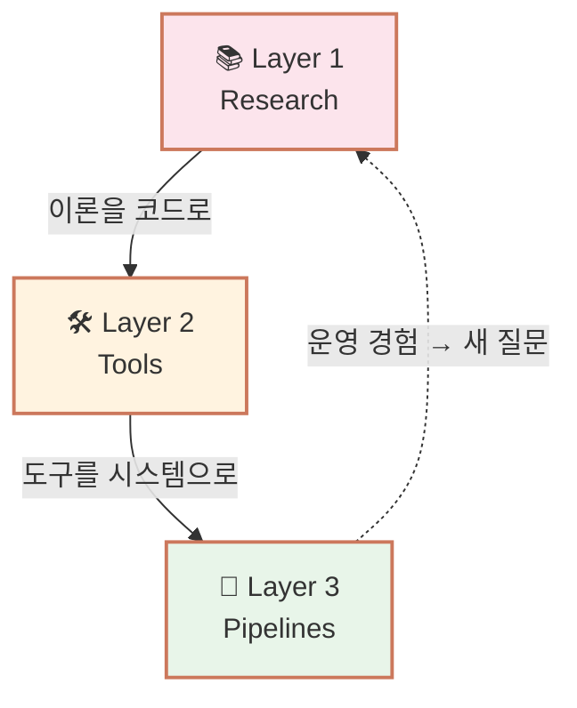
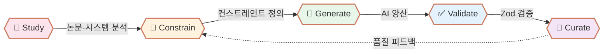

<h1 align="center">
  
  IQ Agent Lab
</h1>

**에이전트 시스템을 연구하고, 도구를 만들고, 콘텐츠를 자동화하는 연구소**

 

 

> *"Theory → Tools → Pipelines — 에이전트를 이해하는 가장 빠른 길은 만들어보는 것."*

표면적인 사용법이 아닌,
**에이전트가 어떻게 설계되고·왜 작동하는가** 를 코드와 운영으로 증명합니다.

 

---

## 🗺️ Three Layers

| Layer | Focus | Output |
|-------|-------|--------|
| 📚 **Research** | 에이전트 아키텍처·메모리·평가 등 이론 정리 | Deep-dive 레포 |
| 🛠️ **Tools** | 이론을 실제 동작하는 도구로 구현 | iq-blogger 등 실행 가능한 시스템 |
| 🚀 **Pipelines** | 도구를 자동화 인프라로 통합·운영 | 콘텐츠를 자동 생산하는 파이프라인 |

세 레이어는 분리되어 있지만 순환합니다. 이론은 도구가 되고, 도구는 시스템이 되며, 운영 경험은 다시 새로운 연구 질문으로 돌아옵니다.

---

## 📚 Layer 1 — Research

&nbsp;🤖 &nbsp;<b>Agent Foundations</b> &nbsp;&nbsp;

 

> 에이전트의 기본 구조와 설계 원칙

| &nbsp; | 📌 Title | 📝 Key Topics |
|:--:|:---------|:----------|
| 1 | **Agent Architectures Deep Dive** | ReAct, Reflexion, AutoGPT, BabyAGI 비교, 설계 패턴 |
| 2 | **Multi-Agent Systems Deep Dive** | 협업 패턴, 역할 분담, 통신 프로토콜, Orchestration |
| 3 | **Agent Tool Use Deep Dive** | Function Calling, MCP 프로토콜, Tool Selection, 안전성 |
| 4 | **Agent Memory Deep Dive** | Short/Long-term Memory, Episodic Memory, RAG 통합 |

 

&nbsp;🔬 &nbsp;<b>Agent Engineering</b> &nbsp;&nbsp;

 

> 에이전트를 실제로 만들고 평가하는 방법

| &nbsp; | 📌 Title | 📝 Key Topics |
|:--:|:---------|:----------|
| 1 | **Agent Eval Deep Dive** | Benchmark 설계, Trajectory 분석, Failure Mode, Cost-Performance |
| 2 | **Agent Deployment Deep Dive** | Production 운영, Observability, Sandboxing, Rate Limiting |
| 3 | **Prompt Engineering for Agents** | System Prompt 설계, Few-shot 패턴, Constraint 강제 |

 

---

## 🛠️ Layer 2 — Tools

현재 운영 중이거나 개발 중인 자동화 도구.

| 도구 | 도메인 | 상태 | 설명 |
|------|------|------|------|
| **iq-blogger** | 텍스트 (블로그) | 🚧 개발 중 | Deep-dive 문서 → 블로그 포스트 자동 변환. Zod 검증 + 11개 컨스트레인트. |
| **iq-label** | 음악 | 📋 기획 | 작곡·편곡 자동화 |
| **iq-writer** | 글쓰기 | 📋 기획 | 소설·에세이 등 장형 글쓰기 |
| **iq-painter** | 이미지 | 📋 기획 | 일러스트·그래픽 생성 |
| **iq-curator** | 통합 | 📋 기획 | 도메인 간 콘텐츠 큐레이션 |

각 도구는 독립적으로 작동하지만, 공통의 검증·재시도·큐레이션 패턴을 공유합니다.

---

## 🚀 Layer 3 — Pipelines

도구들이 통합되어 실제 콘텐츠를 생산하는 운영 시스템.

### 운영 중

- **[iq-proof](https://iq-proof.github.io)** — `iq-blogger`로 운영되는 기술 블로그. 87개 deep-dive 레포에서 500개 이상의 글을 생산하는 첫 검증 사례.

### 계획 중

- 음악 레이블 (iq-label 기반)
- 다도메인 콘텐츠 허브 (iq-curator 기반)

---

## 🔗 Connected Labs

| Lab | 역할 | 관계 |
|-----|------|------|
| [iq-dev-lab](https://github.com/iq-dev-lab) | 백엔드 시스템·인프라 deep-dive | 인프라 기반 제공 |
| [iq-ai-lab](https://github.com/iq-ai-lab) | AI 이론·수학적 기반 deep-dive | 이론 기반 제공 |
| **iq-agent-lab** | 에이전트 시스템·자동화 인프라 | **이론과 시스템을 통합** |

세 연구소는 각자의 영역에서 독립적이지만 본질적으로 연결됩니다. AI 이론이 에이전트의 두뇌가 되고, 백엔드 시스템이 그 인프라가 되며, 에이전트가 다시 모든 연구소의 콘텐츠를 자동화합니다.

---

## 🛠️ Build Method

| Step | Description |
|------|-------------|
| 🔬 **Study** | 도메인 분석, 기존 도구 조사, 패턴 추출 |
| 🎯 **Constrain** | 출력 스키마, 형식, 품질 기준을 코드로 정의 |
| 🤖 **Generate** | 정의된 컨스트레인트 안에서 AI가 양산 |
| ✅ **Validate** | Zod 스키마 + 커스텀 검증 + 자동 재시도 |
| 👤 **Curate** | 인간이 최종 품질 확인 + 발행 결정 |

 

## 💡 Philosophy

> **"인간이 방향을 정하고, 에이전트가 양산하고, 큐레이션이 품질을 보증한다."**

### Why Agents First?

- 🎯 **검증 가능한 자동화** — 자유도가 높은 프롬프트가 아닌, 명시적 컨스트레인트로 일관성 보장
- 🔁 **자기 개선 루프** — 검증 실패 시 자동 재시도, 이전 오류를 학습 데이터로 활용
- 🌐 **도메인 전이** — 한 도메인에서 검증된 패턴을 다른 도메인으로 확장
- 📊 **운영 가능한 시스템** — 일회성 스크립트가 아닌, 매주 글을 발행하는 살아있는 인프라

### Three Principles

1. **Form follows constraint.** 명시적 스키마와 엄격한 검증이 느슨한 프롬프트와 사후 검토보다 더 신뢰할 수 있는 결과를 만든다.
2. **Curation is non-negotiable.** AI는 형식적 일관성을 보장하지만, 진짜 가치는 인간이 판단한다. 큐레이션 없는 자동화는 양산일 뿐이다.
3. **Infrastructure first.** 글 1개를 만드는 것과 500개를 만드는 것은 본질적으로 다른 문제다. 처음부터 시스템으로 설계한다.

 

## 🔗 About

*에이전트 시스템을 만들고 운영하는 1인 연구소의 기록*

 

검증된 결과물은 [**IQ Lab Blog**](https://iq-proof.github.io)에서 확인할 수 있습니다.
시스템 설계 회고와 도메인별 자동화 실험을 발행합니다.

 

Operated by [@e9ua1](https://github.com/e9ua1) (아이큐).

**⭐️ 도움이 되셨다면 Star를 눌러주세요!**

